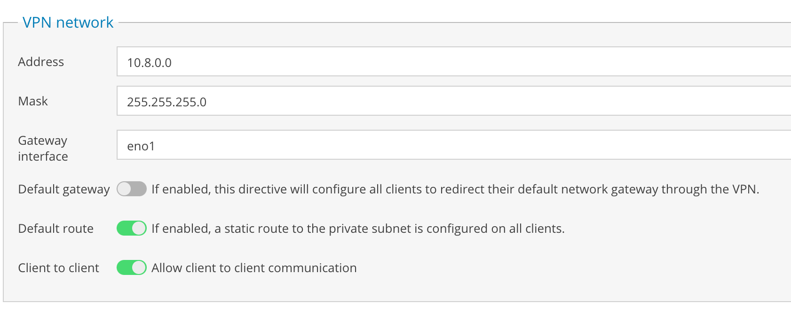

## Introduction
I recently installed [Openmediavault 5](https://www.openmediavault.org/). For those who do NOT know what this software does here is a short/brief description: it is a 
network attached storage (NAS) solution based on Debian Linux that contains or can contain SSH, (S)FTP, SMB/CIFS, DAAP media server, RSync, BitTorrent client, etc. The aspect
I greatly like is the modular design of the framework, which permits enhancement via plugins.

Long story short, I use OMV5 for [Plex](https://www.plex.tv/), as a Rsync server, and now, I want to try playing around with virtual machines (VMs) either via [Cockpit](https://cockpit-project.org/)
 or the KVM plugin found in OMV5. Of course, you could use [Proxmox](https://www.proxmox.com/en/), which is a more entreprise like VM manager, or [Openstack](https://www.openstack.org/). However,
originally, I wanted a NAS. So this little project kind of evolved out of sheer interest.

## Configuration
To give context to this blog and problem - because I am working with KVM, to manage the VMs, I wanted access my VMS via SSH rather than web console. It made sense to me to install the
OpenVPN plugin via the OMV5 interface, but what next? 


With the plugin installed, a new submenu option, OpenVPN, is available. The following were used as general settings:


The following was used for the network:



The address can be changed, but I just used the default setting. I select the gateway to my `eno1`, internet facing interface, and disabled default gateway. With this option enabled, I lost
internet on my client.

For DHCP, I just gave Google DNSs `8.8.8.8,8.8.4.4` and for public address, I just placed the IP of `eno1`.

Well out of the box, OpenVPN works quite nicely once a PAM user is created via OMV5. You can easily download a certificate for OpenVPN 
and then install the OpenVPN client on your client machine(s). I can connect immediately to the OpenVPN server / host machine, ping, and SSH into it. 
BUT, a big BUT, I could not SSH into any of the VMs I created. At first glance at the `/etc/openvpn/server.conf` it is missing the route for my Libvrt interface `virbr0`.
Therefore, I needed to modify the configuration file through SSH rather than the OMV5 interface:

```bash
root@solaris:~# cat /etc/openvpn/server.conf 
port 1194
proto udp
dev tun
ca "/etc/openvpn/pki/ca.crt"
cert "/etc/openvpn/pki/issued/solaris.crt"
key "/etc/openvpn/pki/private/solaris.key" # This file should be kept secret
dh "/etc/openvpn/pki/dh.pem"
topology subnet
server 10.8.0.0 255.255.255.0
ifconfig-pool-persist ipp.txt
;route 192.168.122.0 255.255.255.0
push "route 192.168.122.0 255.255.255.0"
;push "redirect-gateway def1 bypass-dhcp"
push "dhcp-option DNS 8.8.8.8"
push "dhcp-option DNS 8.8.4.4"
client-to-client
keepalive 10 120
comp-lzo
plugin /usr/lib/x86_64-linux-gnu/openvpn/plugins/openvpn-plugin-auth-pam.so login
user nobody
group nogroup
persist-key
persist-tun
status /var/log/openvpn-status.log
log /var/log/openvpn.log
verb 2
mute 10
crl-verify "/etc/openvpn/pki/crl.pem"
;client-config-dir /etc/openvpn/client/
# Extra options
```

Specifically I added `push "route 192.168.122.0 255.255.255.0"` that represents the `virbr0` subnet. 

After restarting my OpenVPN client, I could ping the gateway `192.168.122.1`, but still not VMs. After further reading, I understood that I would need to add a route to each client. 
Considering I am using, OSX, I just used `sudo route -n add 192.168.122.0/24 10.8.0.1`. For linux it should be `sudo route -net add 192.168.122.0/24 gw 10.8.0.1`. Assuming your subnet is 
`192.168.122.0/24`. Change accordingly. Then on each VM I added the static route `sudo route add -net 10.8.0.0/24 gw 192.168.122.1`.

Interesting enough, still not working. Running tcpdump on `tun0`: 

```bash
tcpdump -n -i tun0 dst 192.168.122.28
```

where `dst` is the IP of the VM, I received the following message when attempting to SSH into it: 

```bash
tcpdump - 06:48:49.444452 IP 10.8.0.2.50553 > 192.168.122.28.22: Flags [SEW], seq 734905863, win 65535, options [mss 1360,nop,wscale 6,nop,nop,TS val 3958581044 ecr 0,sackOK,eol], length 0
```

So that looked good, next was to look at the `virbr0` interface:

```bash
tcpdump -n -i virbr0
```

Nothing was observed when trying to SSH into the VM. Well.. this means packets are NOT being forwarded. BINGO. 

Examing the iptables:

```bash
sudo iptables -nvL

...
Chain FORWARD (policy ACCEPT 0 packets, 0 bytes)
 pkts bytes target     prot opt in     out     source               destination         
    0     0 ACCEPT     all  --  *      virbr0  0.0.0.0/0            192.168.122.0/24     ctstate RELATED,ESTABLISHED
    0     0 ACCEPT     all  --  virbr0 *       192.168.122.0/24     0.0.0.0/0           
    0     0 ACCEPT     all  --  virbr0 virbr0  0.0.0.0/0            0.0.0.0/0           
    0     0 REJECT     all  --  *      virbr0  0.0.0.0/0            0.0.0.0/0            reject-with icmp-port-unreachable
    0     0 REJECT     all  --  virbr0 *       0.0.0.0/0            0.0.0.0/0            reject-with icmp-port-unreachable
    2   138 DOCKER-USER  all  --  *      *       0.0.0.0/0            0.0.0.0/0           
    2   138 DOCKER-ISOLATION-STAGE-1  all  --  *      *       0.0.0.0/0            0.0.0.0/0           
    1    86 ACCEPT     all  --  *      docker0  0.0.0.0/0            0.0.0.0/0            ctstate RELATED,ESTABLISHED
    0     0 DOCKER     all  --  *      docker0  0.0.0.0/0            0.0.0.0/0           
    1    52 ACCEPT     all  --  docker0 !docker0  0.0.0.0/0            0.0.0.0/0           
    0     0 ACCEPT     all  --  docker0 docker0  0.0.0.0/0            0.0.0.0/0           
    0     0 REJECT     all  --  virbr0 *       0.0.0.0/0            0.0.0.0/0            reject-with icmp-port-unreachable
...
```

Nothing was being forwarded. There were no rules related to forwarding from source `10.8.0.0/24` and destination `192.168.122.0/24`, which totally makes sense. For some reason, I thought
that OpenVPN would either modify iptables for me or that enabling `sysctl -w net.ipv4.ip_forward=1` IP forwarding was sufficient. Anyhow, I guess that is what happens when you are tired.

Adding the following rule to the forward chain of the filter table:

```bash
sudo iptables -I FORWARD -s 10.8.0.0/24 -d 192.168.122.0/24 -j ACCEPT
```

resolved the problem.

## Final Words
Although a simple fix, surprisingly, all documentation talks about postrouting on the nat table. Anyhow, the above rule allows any incoming traffic from the VPN. So I would suggest tightening up
the rule. Also, do not forget to persist the rule.

I hope the above rule can help others. Best of luck.
