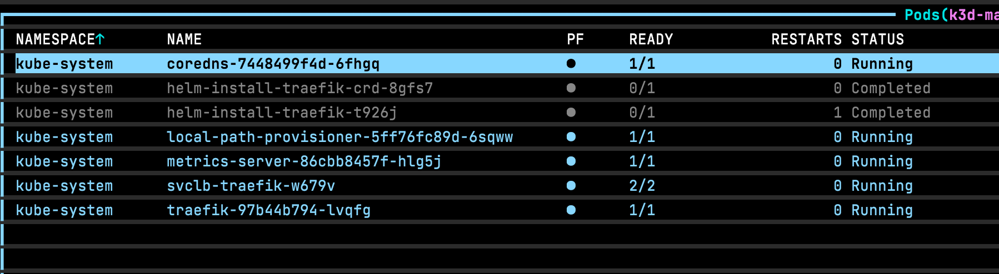

## Introduction
As mentioned in previous articles, [Vagrant](https://www.vagrantup.com/) is a useful tool for development. 
It allows the quick creation of virtual machines, VMs, via decorative syntax and hypervisors, be it Hyper-V, VirtualBox, or some other. 

For sheer interests, I want to work with the latest [K3D](https://k3d.io/), a CLI that utilizes Docker to create a light-weight Kubernetes, [K3S](https://k3s.io/), 
that runs within Docker. Although "HA", high availability, works on the same compute, VMs, whatever, a new [feature](https://github.com/rancher/k3d/pull/734) was just 
incorporated that I would like to use to create remote servers and agents, or rather nodes / node pools. A real HA example.

The below code is work in progress. I have contacted the creators to find a solution to why I cannot attach a node to a remote cluster. Therefore, this article will more than likely
be updated regularly.

## Code
To start, I wrote a simple `Vagrantfile` to create two VMs namely master and slave based on Ubuntu Focal. Now, one could argue, why not just use K3S directly? 
Good question. Normally that would be the best idea here; however, without going into details, I have not been succesful with K3S on a specific distribution of Linux that this work is really
intended for. However, I have had success keeping K3S containerized.

Now I use an inline script to prepare each environment, which does the following:

  - Installs Docker
  - Installs GO
  - Installs Golangci-lint
  - Clones K3D
  - Builds K3D
  - Installs K3D

```ruby
# -*- mode: ruby -*-
# vi: set ft=ruby :

# Vagrantfile API/syntax version. Don't touch unless you know what you're doing!
VAGRANTFILE_API_VERSION = "2"

$script = <<-'SCRIPT'
apt-get update
apt-get -y upgrade
apt-get -y remove docker docker-engine docker.io containerd runc
apt-get -y install apt-transport-https ca-certificates curl gnupg lsb-release git wget build-essential net-tools
curl -fsSL https://download.docker.com/linux/ubuntu/gpg | sudo gpg --dearmor -o /usr/share/keyrings/docker-archive-keyring.gpg
echo \
  "deb [arch=amd64 signed-by=/usr/share/keyrings/docker-archive-keyring.gpg] https://download.docker.com/linux/ubuntu \
  $(lsb_release -cs) stable" | sudo tee /etc/apt/sources.list.d/docker.list > /dev/null
apt-get update
apt-get -y install docker-ce docker-ce-cli containerd.io
groupadd docker
usermod -aG docker vagrant

rm go1.16.5.linux-amd64.tar.gz || true
wget https://golang.org/dl/go1.16.5.linux-amd64.tar.gz
tar -C /usr/local -xzf go1.16.5.linux-amd64.tar.gz

echo 'export PATH=$PATH:/usr/local/go/bin' >> /etc/profile
export PATH=$PATH:/usr/local/go/bin
go version

curl -sSfL https://raw.githubusercontent.com/golangci/golangci-lint/master/install.sh | sh -s -- -b /usr/local/bin v1.39.0
golangci-lint --version

rm -rf k3d || true
git clone https://github.com/rancher/k3d.git
cd k3d
git checkout main-v5
make install-tools
make build
mv bin/k3d /usr/local/bin/k3d
chmod +x /usr/local/bin/k3d
k3d version
SCRIPT


Vagrant.configure(VAGRANTFILE_API_VERSION) do |config|
  config.vm.provision :shell, inline: $script
  config.vm.box = "ubuntu/focal64"

  config.vm.provider "virtualbox" do |v|
      v.memory = 2048
      v.cpus = 4
  end

  config.vm.define "master" do |master|
    master.vm.hostname = "master"
    master.vm.network "private_network", ip: "192.168.5.1"
    master.vm.network :forwarded_port, host: 6443, guest: 6443
  end

  config.vm.define "slave" do |slave|
    slave.vm.hostname = "slave"
    slave.vm.network "private_network", ip: "192.168.5.10"
  end
end
```

I also use private_network with static ips. I do this, in this situation, as I do not want to randomly generate IPs using DHCP. I also port-forward 6443, the API port, that I
assign later to interact with Kubernetes.

Once the master environment is prepared, I create a cluster with a single server:

```bash
export K3D_HELPER_IMAGE_TAG=5.0.0-rc.1
k3d cluster create master -s 1 \
--k3s-arg "--tls-san=192.168.5.1@server:0" \
--k3s-arg "--disable=servicelb@server:0" \
--k3s-arg "--no-deploy=traefik@server:0" \
--k3s-arg "--disable=traefik@server:0" \
--token YtPIwEMJXJebvXfNcZud \
--api-port 6443 \
--verbose
```

Although not required, but for simplicity, I pass a token value. As a side note, to delete the cluster, simply use `k3d cluster delete --all`.

On the slave environment, I use the following command:

```bash
k3d node create testnode --role agent --cluster "https://192.168.5.1:6443" --token YtPIwEMJXJebvXfNcZud --verbose

# To delete
k3d node delete --all
```

Now in theory, from what I understand, this should work to create a cluster. However, this is the not case. Based on the logs of the node I created:

```bash
time="2021-09-18T16:15:05.318593323Z" level=info msg="Containerd is now running"
time="2021-09-18T16:15:05.345947057Z" level=info msg="Updating load balancer server addresses -> [172.18.0.2:6443 192.168.5.1:6443]"
time="2021-09-18T16:15:05.346795741Z" level=info msg="Connecting to proxy" url="wss://172.18.0.2:6443/v1-k3s/connect"
time="2021-09-18T16:17:15.903028956Z" level=error msg="Failed to connect to proxy" error="dial tcp 172.18.0.2:6443: connect: connection timed out"
time="2021-09-18T16:17:15.903280505Z" level=error msg="Remotedialer proxy error" error="dial tcp 172.18.0.2:6443: connect: connection timed out"
```

There is a timeout. In addition, although I passed flags to K3S to disable Traefik and the service load-balancer, both are still created. *I reported this to the creator*. 



Several approaches I thought about to resolve this issue were:

1. Use a Docker Swarm network overlay and pass `--network swarm_network_name`
2. Use `--network host` flag
3. Use version 4.4.* to create a cluster and version 5.0.0 to add a node with `--network host`

The first case, does not appear to work, K3D will complain on cluster creation that the network already exists ????. Further investigation into the K3D code 
there is an IPAM is zero function that breaks with Swarm networks. The second case fails with version 5.0.0 as there is a node number test causing K3D to fail with 
too many nodes. Why? By default, two nodes are created, or rather, two containers, namely a proxy and the server. I suppose having these two use the host network at the same time
would more than likely have some port conflict. The final approach works to attach a remote node to a cluster; HOWEVER, a big, HOWEVER, I run into Coredns failures where the pod
is terminating with `error 1`. I have not figured out why yet, but I believe it has something to do with either `resolv.conf`, iptables, or flannel configurations.

## Final words
This is a work in progress. However, it allows me to become more intimate with K3D source code, written in GO, and to better understand how K3S internals work.